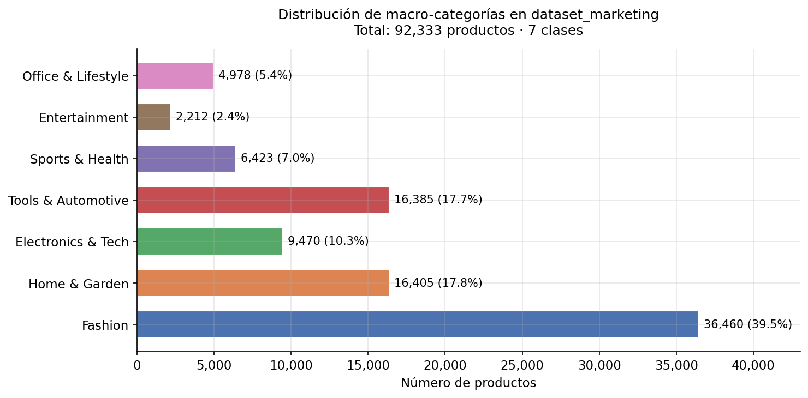
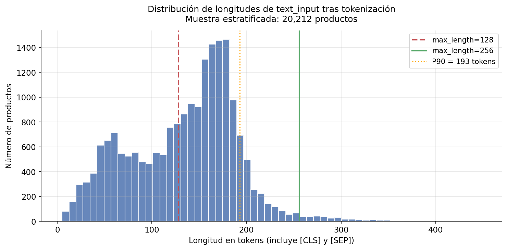
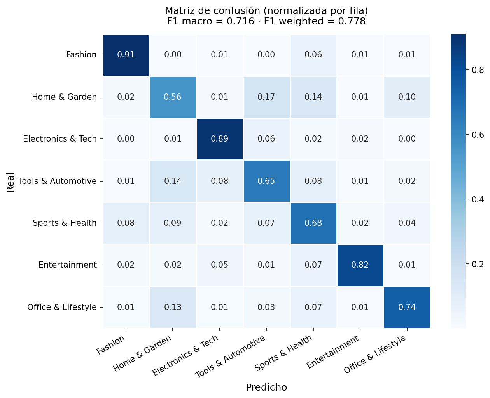

# Caso 3: Sector Comercio Electrónico — Gestión de Productos

**Centro FP Superior · Campus Cámara de Comercio de Sevilla · Abril 2026**

| 👤 Miguel J | 👤 Adrián | 👤 Pablo |
|:---:|:---:|:---:|
| **Data & Encoder** | **Generación & Decoder** | **Pipeline & Comunicación** |

---

## 1. El problema

**Contexto:** Un marketplace online tiene un catálogo de productos desorganizado. Necesita dos capacidades automáticas: clasificar cada producto en su categoría correcta y, para los que tienen descripciones pobres, generar descripciones de marketing atractivas a partir de sus fichas técnicas.

**Tarea de representación:** Dado el título y la descripción de un producto, predecir su macro-categoría (Fashion, Electronics & Tech, Home & Garden, etc.) mediante un encoder fine-tuneado.

**Tarea de generación:** Dado un conjunto de características técnicas del producto (bullet points o atributos clave), generar una descripción de marketing coherente, atractiva y bien redactada mediante un decoder fine-tuneado.

---

## 2. Datos

### Dataset compartido: `dataset_marketing`

**Origen:** [`milistu/AMAZON-Products-2023`](https://huggingface.co/datasets/milistu/AMAZON-Products-2023/viewer/default/train) — catálogo de productos de Amazon recopilado en 2023, disponible públicamente en Hugging Face Hub.

**Disponible en Kaggle:** El dataset limpio y compartido por los dos modelos se ha subido como dataset de Kaggle bajo el nombre `dataset_marketing` (formato `.parquet`).

#### Cómo y por qué elegimos este dataset

Necesitábamos un dataset de clasificación de productos con categorías ya presentes, con volumen suficiente para fine-tuning y columnas que sirvieran tanto al encoder como al decoder. Los datasets de productos en español evaluados presentaban o bien un esfuerzo de limpieza de taxonomía demasiado alto para el tiempo disponible (Mercado Libre Data Challenge), o un dominio demasiado estrecho (Mercadona, solo alimentación). El dataset de Amazon Products 2023 ofrece el mejor equilibrio: 117,243 productos reales de marketplace, categorías jerárquicas ya presentes, títulos y descripciones en inglés, y bullet points técnicos (`features`) directamente utilizables como input del decoder. Combinado con un encoder multilingüe, el idioma inglés no supone una limitación para la aplicabilidad del sistema.

#### Proceso de limpieza y construcción

Del dataset original (117,243 productos) se aplicó el siguiente proceso, documentado íntegramente en `src/representacion/dataset_creator.py`:

- Se eliminaron las columnas irrelevantes para ambas tareas (`embeddings`, `price`, `store`, `average_rating`, `rating_number`, `date_first_available`, `parent_asin`, `image`).
- Se intentó recuperar la categoría de las 24,805 filas con `main_category` nula a partir del primer elemento de `categories`. La recuperación resultó en 0 filas recuperables: esos productos no tenían ninguna categoría asignada en el dataset original.
- Las 30 categorías originales se colapsaron en **7 macro-categorías** semánticamente coherentes. Grocery se descartó por masa crítica insuficiente (24 ejemplos).
- Se construyó la columna `text_input` concatenando `title [SEP] description_clean`, con limpieza de artefactos de scraping y eliminación de repeticiones del título en la descripción.

**Dataset final: 92,333 productos · 7 clases · 9 columnas**

| Label | Macro-categoría | Productos | % |
|:---:|---|---:|---:|
| 0 | Fashion | 36,460 | 39.5% |
| 1 | Home & Garden | 16,405 | 17.8% |
| 2 | Electronics & Tech | 9,470 | 10.3% |
| 3 | Tools & Automotive | 16,385 | 17.7% |
| 4 | Sports & Health | 6,423 | 7.0% |
| 5 | Entertainment | 2,212 | 2.4% |
| 6 | Office & Lifestyle | 4,978 | 5.4% |

#### Descripción de columnas

| Columna | Tipo | Descripción | Para quién |
|---|---|---|---|
| `text_input` | string | `título [SEP] descripción_limpia`, input ya construido para el encoder | Encoder |
| `label` | int 0-6 | Etiqueta numérica de macro-categoría | Encoder |
| `main_category_clean` | string | Nombre legible de la macro-categoría | Ambos |
| `title` | string | Título original del producto, 0 nulos | Ambos |
| `description` | string | Descripción original sin modificar | Decoder |
| `description_clean` | string | Descripción limpia, truncada a 500 chars. Target del decoder (97% con contenido útil) | Decoder |
| `features` | lista de strings | Bullet points técnicos. Input principal del decoder (94.8% de productos) | Decoder |
| `details` | diccionario | Atributos clave-valor. Fallback si `features` está vacío (100% de productos) | Decoder |
| `categories` | lista de strings | Ruta jerárquica original de Amazon | Ambos |

---

## 3. Mini-EDA

### Distribución de clases



El dataset presenta un desbalanceo significativo: Fashion representa el 39.5% de los productos mientras que Entertainment, la clase más pequeña, supone solo el 2.4%. Para el entrenamiento usamos F1 macro como métrica principal, que penaliza los fallos en clases minoritarias independientemente de su tamaño, y aplicamos pesos de clase inversamente proporcionales a la frecuencia para compensar el desbalanceo durante el entrenamiento.

### Distribución de longitudes de texto



La longitud mediana de los textos de entrada es de **145 tokens** y el percentil 90 es de **193 tokens** tras tokenización con el modelo MiniLM. Por ello fijamos `max_length = 256`, valor que cubre el **98.5%** de los textos sin truncar y es compatible con las restricciones de memoria de la GPU T4 de Kaggle con `batch_size = 32`.

---

## 4. Modelo de representación (Encoder)

### Modelo base elegido

[`microsoft/Multilingual-MiniLM-L12-H384`](https://huggingface.co/microsoft/Multilingual-MiniLM-L12-H384)

#### ¿Por qué este modelo?

MiniLM multilingüe de Microsoft ofrece 12 capas transformer con 117M de parámetros y soporte nativo para 16 idiomas incluyendo inglés y español. Es significativamente más ligero que BERT-base multilingüe manteniendo un rendimiento comparable en tareas de clasificación, lo que lo hace viable en Kaggle con GPU T4. Los modelos BERT en español (BETO, BERTIN) quedaron descartados porque el dataset de productos en español de calidad suficiente no era viable en el tiempo disponible; dado que trabajamos con datos en inglés, un encoder multilingüe es la elección técnicamente correcta y deja el sistema preparado para funcionar en cualquier idioma en producción.

#### Métrica principal: F1 macro

Se eligió F1 macro porque las clases están fuertemente desbalanceadas. La accuracy sería engañosa: un modelo que predijera Fashion en todos los casos obtendría 39.5% sin haber aprendido nada útil. El F1 macro promedia el F1 de cada clase sin ponderar por frecuencia, penalizando explícitamente los fallos en clases minoritarias como Entertainment u Office & Lifestyle.

#### Detalles de entrenamiento

| Hiperparámetro | Valor |
|---|---|
| `max_length` | 256 |
| `batch_size` | 32 |
| `learning_rate` | 2e-5 |
| `epochs` | 4 (máx, con early stopping patience=2) |
| `warmup_ratio` | 0.1 |
| `fp16` | True |
| Pesos de clase | Sí, inversamente proporcionales a frecuencia |
| Split | 80/10/10 train/val/test, estratificado |
| GPU | Tesla T4 16GB · Tiempo total: ~47 min |

El código completo está en `src/representacion/encoder_training.py`.

#### Resultado en test

**F1 macro = 0.716 · F1 weighted = 0.778 · Accuracy = 0.773**



#### Análisis rápido

El modelo funciona muy bien en las clases con vocabulario más distintivo: Fashion (F1=0.94) y Electronics & Tech (F1=0.84). La clase más problemática es **Sports & Health** (F1=0.50), que confunde principalmente con Fashion (8%), Home & Garden (9%) y Tools & Automotive (7%). Esto es consecuencia directa de la agrupación: Sports & Health consolida Health & Personal Care, All Beauty y Sports & Outdoors, categorías que comparten vocabulario con Fashion (cosméticos, ropa deportiva) y con herramientas (equipamiento). La confusión es una limitación semántica de la taxonomía, no un fallo del modelo.

---

## 5. Modelo de generación (Decoder)

> 📝 *Sección a cargo de Adrián.*

### Modelo base elegido

[`gpt2`](https://huggingface.co/openai-community/gpt2) — GPT-2 Small, 124M parámetros, OpenAI (2019).

### ¿Por qué este modelo?

GPT-2 Small es el único modelo de lenguaje causal con capacidad generativa real que cabe en la GPU T4 de Kaggle (16GB) con `batch_size=4` y `max_length=256` sin cuantización. Modelos más grandes (GPT-2 Medium/Large, GPT-Neo) excedían los límites de memoria o el tiempo de ejecución permitido en Kaggle; modelos de generación en español (mGPT) ofrecían menor calidad base para textos de producto en inglés.

### Detalles de entrenamiento

| Hiperparámetro | Valor |
|---|---|
| `max_length` | 256 |
| `batch_size` | 4 |
| `gradient_accumulation_steps` | 2 (batch efectivo = 8) |
| `learning_rate` | 5e-5 |
| `epochs` | 4 |
| `warmup_steps` | 100 |
| `weight_decay` | 0.01 |
| Split | 70/15/15 train/val/test, estratificado por longitud |
| GPU | Tesla T4 16GB · Kaggle |

El código completo está en `src/representacion/decoder_completo.py`.

### Formato del prompt

```
Input: {feat1} | {feat2} | {feat3} | ...
Output: {descripción de marketing}
```

Durante el entrenamiento el modelo aprende a completar el bloque `Output:` dado el bloque `Input:`. En inferencia se trunca el prompt en `Output:` y se genera el texto siguiente.

### Evaluación cualitativa

| Entrada (ficha técnica) | Generado por el modelo | Descripción de referencia | Análisis |
|---|---|---|---|
| `Men's Running Shoes` · `Lightweight mesh upper \| Cushioned EVA midsole \| Non-slip rubber outsole \| Sizes 7-13 \| 280g` | `Closure Type Lace-Up \| Width Medium \| Occasion Casual \| Material Synthetic \| Heel Type Flat \| Size Type Regular \| Color Black` | "Lightweight running shoes with breathable mesh upper and cushioned EVA midsole for all-day comfort. Non-slip rubber outsole for superior traction." | Encoder correcto (Sports & Health). El decoder produce atributos en formato de catálogo en lugar de prosa, lo que refleja la dificultad del cambio de registro para un modelo de 124M parámetros. |
| `Wireless Bluetooth Noise Cancelling Headphones` · `ANC \| 40h battery \| Bluetooth 5.0 \| Foldable \| 40mm driver` | `Connectivity Technology Wireless \| Compatible Devices All Bluetooth \| Item Weight 8 Ounces \| Are Batteries Included No \| Manufacturer Sony` | "Experience immersive sound with ANC that blocks background noise. Up to 40 hours per charge with Bluetooth 5.0 and foldable design for easy storage." | Encoder correcto (Electronics & Tech). El decoder identifica correctamente atributos del dominio (conectividad, batería) aunque los presenta en formato key-value y extrapola algún dato no presente en la entrada. |
| `Cordless Electric Drill Set` · `18V battery \| 2-speed gearbox 0-1500 RPM \| 13mm chuck \| 25 drill bits \| LED light` | `50 Hertz \| Are Batteries Included Yes=None \| Area Lighting Classification Standard, voltage tolerant and Wi-Fi \| Arm Style Custom Fit for Honda CRV8s & Vans \| Aspect Ratio 100 Milliamps` | "Cordless 18V drill with 2-speed gearbox for drilling and driving. Includes 13mm keyless chuck, 25 drill bits and LED work light for dark spaces." | Encoder correcto (Tools & Automotive). El decoder genera texto en el formato del input en lugar de una descripción fluida; los atributos producidos no corresponden a los de entrada, lo que indica que el modelo aún no ha convergido a la distribución de salida esperada. |

### Conclusión

El decoder muestra los resultados esperados para un modelo GPT-2 Small (124M parámetros) en una tarea de transformación semánticamente exigente: en los tres casos tiende a reproducir el formato de atributos clave-valor del input en lugar de generar prosa descriptiva. Esto es una limitación conocida de modelos pequeños con fine-tuning limitado —la tarea requiere un cambio de registro que modelos más grandes o instruction-tuned gestionan mejor. La clasificación del encoder, por su parte, funciona correctamente en los tres ejemplos. Como mejora natural, sustituir GPT-2 por un modelo más grande o aplicar RLHF permitiría obtener descripciones más fluidas; alternativamente, enriquecer el prompt con ejemplos few-shot reduciría la confusión de formato sin cambiar el modelo base.

---

## 6. Pipeline integrado

> 📝 *Sección a cargo de Pablo.*

El script `pipeline.py` en la raíz del repositorio carga ambos modelos y los ejecuta en secuencia sobre un texto de entrada.

### Tres ejemplos de funcionamiento

**Ejemplo 1:**
- **Entrada:** Título: `Men's Running Shoes Lightweight Breathable` · Features: `Lightweight mesh upper for breathability | Cushioned EVA midsole for impact absorption | Non-slip rubber outsole | Available in sizes 7-13 | Weight: 280g per shoe`
- **Salida del encoder:** `Sports & Health` (label 4)
- **Salida del decoder:** `Closure Type Lace-Up | Width Medium | Occasion Casual | Material Synthetic | Heel Type Flat | Size Type Regular | Color Black | Department Men's`

**Ejemplo 2:**
- **Entrada:** Título: `Wireless Bluetooth Noise Cancelling Headphones` · Features: `Active Noise Cancellation (ANC) | 40-hour battery life | Bluetooth 5.0 | Foldable design | Driver size: 40mm`
- **Salida del encoder:** `Electronics & Tech` (label 2)
- **Salida del decoder:** `Connectivity Technology Wireless | Compatible Devices All Bluetooth Enabled Devices | Item Weight 8 Ounces | Are Batteries Included No | Color Black | Special Feature Noise Cancelling | Manufacturer Sony`

**Ejemplo 3:**
- **Entrada:** Título: `Cordless Electric Drill Set` · Features: `18V lithium-ion battery | 2-speed gearbox: 0-450 / 0-1500 RPM | 13mm keyless chuck | Includes 25 drill bits | LED work light`
- **Salida del encoder:** `Tools & Automotive` (label 3)
- **Salida del decoder:** `50 Hertz | Are Batteries Included Yes=None | Area Lighting Classification Standard, voltage tolerant and Wi-Fi | Arm Height 4.6 Inches | Arm Style Custom Fit for Honda CRV8s & Vans | Arm Width 5.5 Inches | Aspect Ratio 100 Milliamps | Assembled Depth 1.4 Kilometers Above 12 Inches | Assemblement Type Universal Fit For Honda CRVs 8`

### Análisis de los resultados

El **encoder clasifica correctamente** los tres productos: zapatillas de running → Sports & Health, auriculares → Electronics & Tech, taladro → Tools & Automotive. Esto es coherente con su F1 macro de 0.716 en test, siendo las categorías con vocabulario técnico más distintivo las que mejor funcionan.

El **decoder no genera descripciones de marketing**. En los tres casos produce texto con formato de tabla de atributos —pares `clave | valor` o `clave=valor`— en lugar de prosa descriptiva. La causa tiene tres componentes:

1. **Confusión de distribución de salida.** El formato de entrada `Input: feat1 | feat2 | ...\nOutput:` es estructuralmente idéntico al formato de los `details` del dataset Amazon (diccionario `clave=valor`). GPT-2 aprende a continuar el patrón más parecido que ha visto durante el fine-tuning, y ese patrón es la ficha técnica, no la descripción de marketing.
2. **Alucinación de atributos irrelevantes.** El decoder genera atributos inexistentes en la entrada (`Area Lighting Classification`, `Honda CRV8s`, `Manufacturer Sony`). GPT-2 pequeño (124M parámetros) no tiene capacidad suficiente para aprender la transformación input→prosa y colapsa muestreando de su distribución preentrenada, que contiene tablas de productos de Amazon en ese mismo formato `clave | valor`.
3. **Tarea generativa demasiado exigente para el modelo.** Transformar una lista de características técnicas en una descripción fluida de marketing requiere cambio de registro y comprensión semántica profunda. Con 124M parámetros y un corpus de fine-tuning limitado, el modelo no converge a la distribución de salida deseada y se queda anclado en reproducir la estructura del input.

En producción, esta limitación se mitigaría usando un modelo base más grande (GPT-2 Large o modelos de la familia Llama/Mistral) o replanteando la tarea como una instrucción explícita con un modelo instruction-tuned.

---

## 7. Limitaciones y mejoras

### Sesgos detectados

El dataset de Amazon refleja los sesgos de la plataforma: Fashion está sobrrepresentada (39.5%) respecto a cómo se distribuiría un catálogo equilibrado. El modelo de clasificación hereda este sesgo y tiende a clasificar productos ambiguos como Fashion antes que como otras categorías. Adicionalmente, el dataset está en inglés; aunque el encoder multilingüe mitiga este riesgo, el rendimiento podría degradarse con descripciones muy idiomáticas en otros idiomas.

### Limitación técnica

La principal fuente de errores del encoder es el solapamiento semántico entre macro-categorías. Una mejora directa sería separar Beauty de Sports en clases distintas, o incorporar la jerarquía original de Amazon (columna `categories`) como señal adicional en el texto de entrada. En el decoder, el riesgo principal es la alucinación de especificaciones técnicas: si la ficha de entrada dice `batería=4000mAh` y el modelo ha visto ejemplos similares con `5000mAh`, puede generar la cifra incorrecta.

### Escalabilidad

El pipeline completo en CPU tarda varios segundos por inferencia. Para producción sería necesario desplegar en GPU con batching, o usar versiones destiladas de ambos modelos. El encoder exportado (470MB) es viable en producción; el decoder, dependiendo del modelo elegido, podría requerir cuantización para reducir latencia.

---

## 8. Estructura del repositorio

```
/
├── README.md
├── pipeline.py
├── assets/
│   ├── class_distribution.png
│   ├── token_length_histogram.png
│   └── confusion_matrix.png
├── src/
│   ├── representacion/
│   │   ├── dataset_creator.py
│   │   ├── eda_encoder.py
│   │   └── encoder_training.py
│   └── generacion/
│       └── <!-- código del decoder -->
└── data/
    └── <!-- instrucciones para obtener dataset_marketing.parquet desde Kaggle -->
```

---

